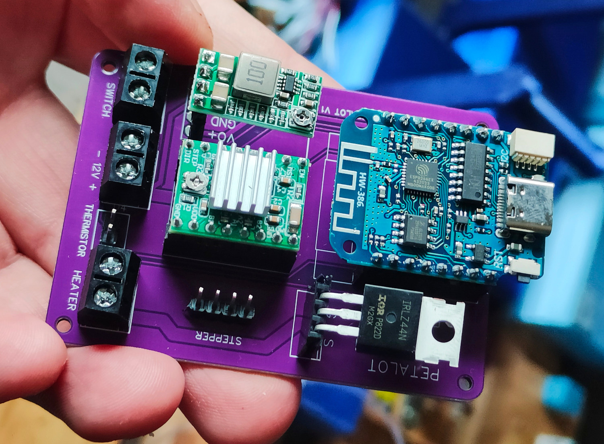
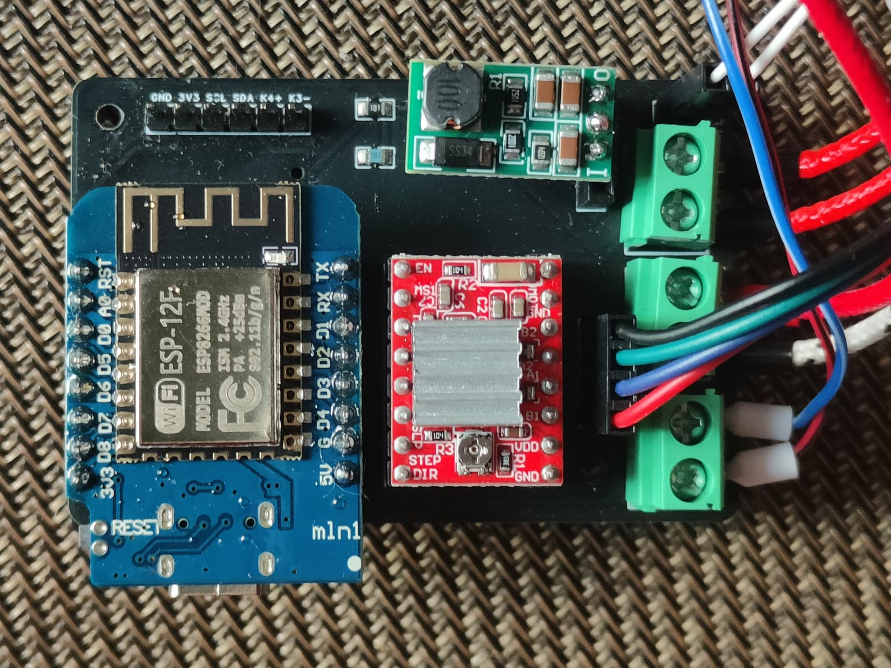
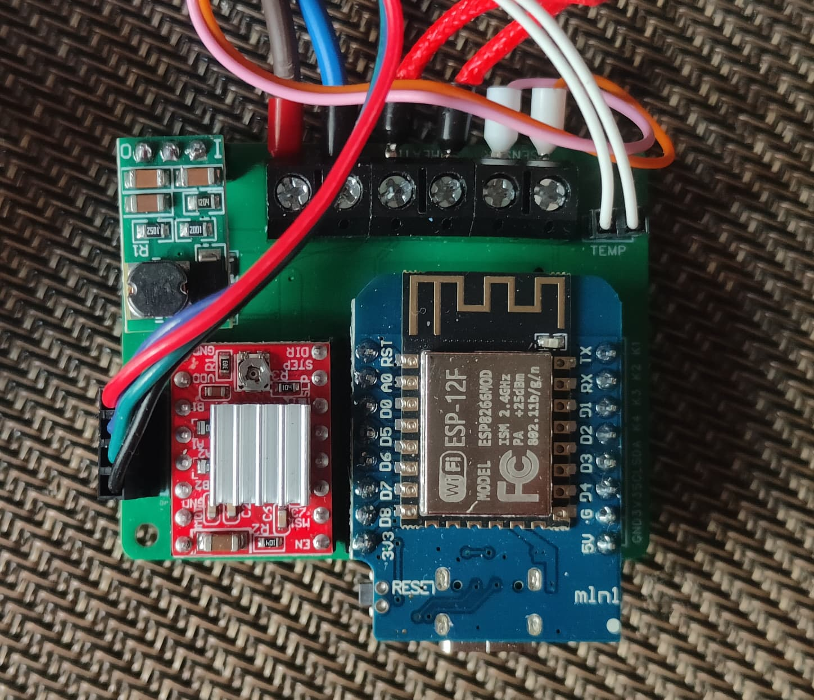

# PETALOT Firmware

There is **one firmware**, built separately for each PCB version. The three
builds are functionally identical and share the same web UI; they only differ
in the microcontroller pin mapping (defined in `pins.hpp`). Pick the `.bin`
that matches the PCB you have installed.

## Which firmware do I need?

| PCB version | Firmware file | Availability |
| --- | --- | --- |
| **v1.4.5** | [`petalot.v1.4.5.bin`](Firmware/petalot/build/esp8266.esp8266.d1_mini_clone/petalot.v1.4.5.bin) | **DIY** — the only board released publicly. |
| **v1.5.1** | [`petalot.v1.5.1.bin`](Firmware/petalot/build/esp8266.esp8266.d1_mini_clone/petalot.v1.5.1.bin) | **Commercial**. |
| **v1.5.2** | [`petalot.v1.5.2.bin`](Firmware/petalot/build/esp8266.esp8266.d1_mini_clone/petalot.v1.5.2.bin) | **Commercial** (current). |

- If you built your own PETALOT from the public files, your PCB is the **v1.4.5**.
- Versions **v1.5.1** and **v1.5.2** are only fitted on commercially sold machines.

> Do not flash a firmware that does not match your PCB.

## Identify your PCB

| v1.4.5 (DIY) | v1.5.1 | v1.5.2 |
| --- | --- | --- |
|  |  |  |

## First-time flash

1. Connect the Wemos to your PC.
2. Go to https://web.esphome.io/
3. Click **Connect**, select **USB Serial** port and **Connect**.
4. Click **Install**, then **Choose File**, select the `.bin` for your PCB and click **Install**.
5. Connect your phone to the Wi-Fi "PETALOT-XXXXXX" and browse to 192.168.4.1.
6. (Optional) Enter your local Wi-Fi SSID, password, IP address and subnet.

## Updating an existing device

You do not need a cable: update over the air.

1. Browse to `http://<device-ip>/update` (the built-in OTA page). This is the
   update method available on **every** firmware version — older builds only
   ship this one, since the update section in *Settings* is new in the current
   build.
2. Select the `.bin` matching your PCB (`petalot.v1.4.5.bin`,
   `petalot.v1.5.1.bin` or `petalot.v1.5.2.bin`) and click **Update**.

If your device is already running the current build, you can also update from
the web UI: **Settings → Advanced → Firmware Update** — same result.

## Building from source

1. Open `Firmware/petalot/petalot.ino` in the Arduino IDE.
2. Set `VERSION` to the board you are compiling for:

   | `VERSION` | PCB |
   | --- | --- |
   | `1405` | v1.4.5 |
   | `1501` | v1.5.1 |
   | `1502` | v1.5.2 |

3. Select **Tools > Board > esp8266 > LOLIN(WEMOS) D1 mini (clone)**.
4. Compile and upload.

The pin mapping for every version lives in `Firmware/petalot/pins.hpp`. See
[`INSTALL_LIBRARIES.md`](Firmware/petalot/INSTALL_LIBRARIES.md) for the required
libraries and board setup.
